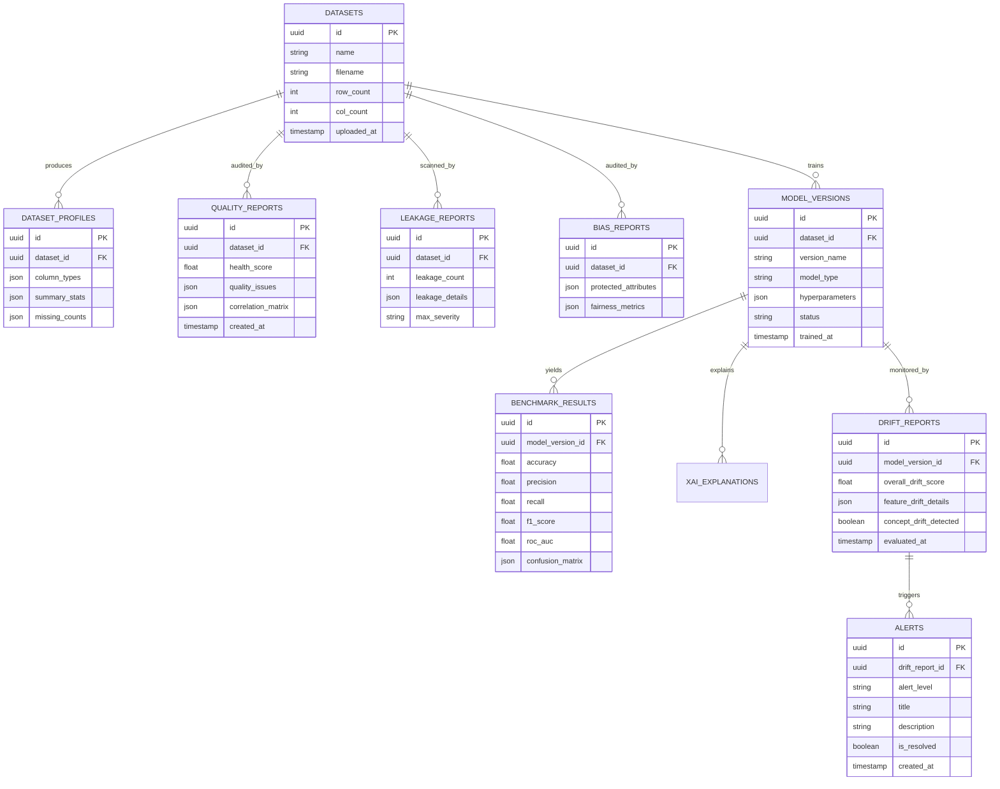

# AI Dataset Doctor & Model Health Monitor
## Complete Technical Blueprint, Architecture & Project Guide

---

## 1. Complete System Architecture

The **AI Dataset Doctor & Model Health Monitor** is an enterprise-grade MLOps platform structured around a decoupled, event-driven, modular architecture. It bridges pre-training Data Quality Engineering with post-deployment Model Health & Drift Monitoring.

```mermaid
graph TD
    subgraph Client Layer
        UI["React / Next.js SPA Dashboard"]
        Swagger["OpenAPI / Swagger UI"]
    end

    subgraph API Gateway & Service Layer
        FastAPI["FastAPI App Gateway"]
        AuthModule["Auth & RBAC Middleware (JWT)"]
    end

    subgraph Core Diagnostic Engines
        DP Engine["Data Profiler & Quality Doctor"]
        DL Engine["Data Leakage Detector"]
        BF Engine["Bias & Fairness Analyzer"]
        AutoML Engine["AutoML Benchmark & Recommendation"]
        XAI Engine["Explainable AI Engine (SHAP)"]
        Drift Engine["Model Health & Drift Monitor"]
        Alert Engine["Alert & Threshold Evaluator"]
    end

    subgraph Data & Storage Layer
        DB[(PostgreSQL Database)]
        ModelStore["Model Registry / Artifact Store (.pkl / .joblib / ONNX)"]
        DatasetStore["Dataset Store (S3 / Local Storage)"]
    end

    UI -->|REST / JSON| FastAPI
    Swagger -->|REST / JSON| FastAPI
    FastAPI --> AuthModule
    AuthModule --> Core Diagnostic Engines

    DP Engine --> DB
    DL Engine --> DB
    BF Engine --> DB
    AutoML Engine --> ModelStore
    XAI Engine --> DB
    Drift Engine --> DB
    Alert Engine --> DB

    DP Engine --> DatasetStore
    Drift Engine --> DatasetStore
```

### Architectural Key Highlights
1. **Decoupled Engine Design**: Diagnostic tasks (Profiling, Leakage, Bias, AutoML, SHAP, Drift) are independent python modules implementing clean interfaces.
2. **Double-Pass Pipeline**:
   - **Pre-Training Pass (Dataset Doctor)**: Ingests raw data -> profiles data -> flags quality defects & leakage -> evaluates fairness -> benchmarks baseline models -> computes SHAP feature importance.
   - **Post-Training Pass (Model Health Monitor)**: Ingests inference logs / new batches -> computes KS-test & PSI drift metrics -> compares accuracy/F1 drops -> generates alert triggers -> updates Model Registry.
3. **Stateless Fast Execution with Persistent Storage**: Heavy computations happen asynchronously or via optimized vectorized Pandas/Numpy operations, persisted in PostgreSQL for history tracking.

---

## 2. Detailed Module Breakdown

### Module 1: Dataset Ingestion & Profiler (`data_profiler.py`)
- **Supported Formats**: CSV, Excel (`.xlsx`, `.xls`), Parquet.
- **Auto Schema Detection**:
  - *Numerical*: Continuous (float) vs. Discrete (int) based on uniqueness ratio.
  - *Categorical*: Nominal vs. Ordinal based on unique string count and heuristics.
  - *Datetime*: Auto-parse ISO format strings, timestamps, date patterns.
  - *Target Column*: User-specified or auto-detected (last column / class name heuristics).
- **Output**: Full statistical summaries (Mean, Std, Min, Max, Quantiles 25/50/75, Skewness, Kurtosis).

### Module 2: Data Quality Doctor (`quality_doctor.py`)
- **Missing Values**: Total & percentage per column; missingness pattern analysis.
- **Duplicate Rows**: Exact duplicate identification and percentage.
- **Outlier Detection**: Z-Score ($|Z| > 3$) and IQR Rule ($Q1 - 1.5\times IQR$, $Q3 + 1.5\times IQR$).
- **Invalid / Anomalous Values**: Mixed type detection, infinite values (`Inf`/`-Inf`), unparseable characters.
- **Constant / Near-Constant Features**: Variance threshold ($Variance < 0.01$ or single value ratio $> 95\%$).
- **High-Cardinality Features**: Categorical columns where unique value count $> 50$ or unique ratio $> 30\%$.
- **Class Imbalance**: Target class ratio analysis (e.g., Gini index or Imbalance Ratio $> 4:1$).
- **High Feature Correlation**: Pearson correlation ($r > 0.85$) for numerical features; Cramer's V for categorical features.

### Module 3: Data Leakage Detection (`leakage_detector.py`)
- **Target Correlation Leakage**: Identifies features with near-perfect correlation with target ($|r| > 0.95$).
- **Information Gain / Mutual Information**: Computes $I(X; Y)$; flags features carrying disproportionate target entropy reduction.
- **Perfect Predictors / Single-Feature Split**: Decision tree classifier depth=1 accuracy check ($Accuracy > 0.98$).
- **Duplicates Across Train/Test**: Flag data leakage where identical rows exist in both train and validation splits.
- **Severity Scoring**:
  - `CRITICAL`: Feature ratio or mutual info indicates target derivative column (e.g., `loan_paid_status` predicting `default`).
  - `HIGH`: Extremely high correlation ($>0.90$).
  - `MEDIUM`: Moderate correlation ($0.75-0.90$).
  - `LOW`: Mild association.

### Module 4: Bias & Fairness Analysis (`bias_analyzer.py`)
- **Protected Attribute Detection**: Auto-detects columns like `Gender`, `Race`, `Age`, `Ethnicity`, `Marital_Status`.
- **Demographic Parity Ratio**:
  $$\text{DPR} = \frac{P(\hat{Y}=1 \mid A=\text{unprivileged})}{P(\hat{Y}=1 \mid A=\text{privileged})}$$
  (Ideal range: $0.80 - 1.25$).
- **Equalized Odds Ratio**: Compares True Positive Rate (TPR) and False Positive Rate (FPR) across groups.
- **Statistical vs Real-World Bias Distinction**: Output explicitly labels statistical disparities vs. domain-specific bias claims to ensure scientific integrity.

### Module 5: Automated ML Benchmark (`automl_benchmark.py`)
- **Models Evaluated**:
  - Logistic Regression (Baseline linear classifier)
  - Random Forest Classifier (Tree ensemble baseline)
  - XGBoost Classifier (Gradient boosting engine)
  - Support Vector Machine (Kernel SVM)
- **Cross-Validation & Metrics**: 5-Fold Stratified CV.
  - Accuracy, Precision, Recall, F1-Score, ROC-AUC, Confusion Matrix, Training Time.
- **Recommendation Engine**: Multi-objective ranking balancing F1-score, latency, and model complexity.

### Module 6: Explainable AI (`xai_engine.py`)
- **SHAP (SHapley Additive exPlanations)**:
  - Global Feature Importance: Mean absolute SHAP values across dataset $\sum |\phi_i|$.
  - Local Explanations: Waterfall / Force plot representation for individual sample predictions.
  - Interaction Effects: Feature interaction matrices.

### Module 7: Model Health Monitoring (`drift_monitor.py`)
- **Data Drift (Feature Distribution)**:
  - Continuous Features: Two-sample Kolmogorov-Smirnov (KS) test ($p\text{-value} < 0.05$).
  - Categorical Features: Population Stability Index (PSI) ($PSI > 0.25 \implies \text{Significant Drift}$) or Chi-Square Test.
- **Concept Drift**: Performance metric degradation over time when ground truth labels become available (e.g., F1 drops by $> 10\%$).
- **Feature Importance Drift**: Tracking changes in top SHAP feature rankings over time.

### Module 8: Alert System (`alert_engine.py`)
- **Rule Evaluator**: Evaluates post-ingestion quality metrics and post-deployment monitoring against thresholds.
- **Alert Levels**: `INFO`, `WARNING`, `CRITICAL`.
- **Channels**: Database logger, API dashboard alerts, Webhook/Email notifications capability.

### Module 9: Model Registry (`registry.py`)
- **Version Control**: Semantic versioning for models (`v1.0.0`, `v1.1.0`).
- **Artifact Management**: Hyperparameters, dataset hash, evaluation metrics, feature schema, creation timestamp, deployment status (`Staging`, `Production`, `Archived`).

### Module 10: Unified React Dashboard
- High-level **Dataset Health Score** gauge ($0 - 100$).
- Interactive Tabs: **Data Doctor**, **Data Leakage**, **Bias & Fairness**, **Model Benchmarking**, **Explainable AI**, **Model Monitoring & Drift**, **Alert Center**, **Model Registry**.

---

## 3. Database Schema & ER Diagram Description

The relational database schema is designed for PostgreSQL (with SQLite compatibility).



---

## 4. API Design (RESTful OpenAPI Specification)

| Method | Endpoint | Description |
| :--- | :--- | :--- |
| **POST** | `/api/v1/datasets/upload` | Upload CSV/Excel file, parse schema, return dataset ID |
| **GET** | `/api/v1/datasets/{id}/profile` | Fetch dataset summary statistics and column profiles |
| **POST** | `/api/v1/quality/analyze` | Run Quality Doctor diagnosis, return health score & defects |
| **POST** | `/api/v1/leakage/detect` | Run Data Leakage scanner, return severity scores & explanations |
| **POST** | `/api/v1/bias/analyze` | Run Bias & Fairness audit on protected attributes |
| **POST** | `/api/v1/benchmark/run` | Trigger AutoML benchmarking on dataset across LR, RF, XGB, SVM |
| **GET** | `/api/v1/explainability/{model_id}` | Fetch SHAP global feature importance and sample explanations |
| **POST** | `/api/v1/monitoring/drift` | Compare baseline vs reference dataset, compute KS/PSI drift metrics |
| **GET** | `/api/v1/alerts` | List all system alerts filtered by severity or status |
| **GET** | `/api/v1/registry/models` | List all registered model versions, metrics, and deployment status |

---

## 5. Folder Structure

```
ai-dataset-doctor/
├── backend/
│   ├── app/
│   │   ├── api/
│   │   │   ├── endpoints/
│   │   │   │   ├── datasets.py
│   │   │   │   ├── quality.py
│   │   │   │   ├── leakage.py
│   │   │   │   ├── bias.py
│   │   │   │   ├── benchmark.py
│   │   │   │   ├── explainability.py
│   │   │   │   ├── monitoring.py
│   │   │   │   ├── alerts.py
│   │   │   │   └── registry.py
│   │   │   └── router.py
│   │   ├── core/
│   │   │   ├── config.py
│   │   │   ├── database.py
│   │   │   ├── db_models.py
│   │   │   └── security.py
│   │   ├── schemas/
│   │   │   └── schemas.py
│   │   ├── services/
│   │   │   ├── data_profiler.py
│   │   │   ├── quality_doctor.py
│   │   │   ├── leakage_detector.py
│   │   │   ├── bias_analyzer.py
│   │   │   ├── automl_benchmark.py
│   │   │   ├── xai_engine.py
│   │   │   ├── drift_monitor.py
│   │   │   └── alert_engine.py
│   │   └── main.py
│   ├── tests/
│   │   ├── test_quality_doctor.py
│   │   ├── test_leakage_detector.py
│   │   ├── test_automl_benchmark.py
│   │   ├── test_drift_monitor.py
│   │   └── test_api.py
│   ├── Dockerfile
│   └── requirements.txt
├── frontend/
│   ├── src/
│   │   ├── components/
│   │   │   ├── QualityOverview.jsx
│   │   │   ├── LeakagePanel.jsx
│   │   │   ├── BiasAudit.jsx
│   │   │   ├── BenchmarkTable.jsx
│   │   │   ├── SHAPVisualizer.jsx
│   │   │   ├── DriftMonitorChart.jsx
│   │   │   ├── AlertsWidget.jsx
│   │   │   └── ModelRegistryView.jsx
│   │   ├── pages/
│   │   │   └── Dashboard.jsx
│   │   ├── services/
│   │   │   └── api.js
│   │   ├── App.jsx
│   │   └── main.jsx
│   ├── Dockerfile
│   └── package.json
├── data/
│   ├── heart_disease_sample.csv
│   └── adult_census_income_sample.csv
├── docker-compose.yml
└── README.md
```

---

## 6. End-to-End ML Pipeline Workflow

1. **Dataset Ingestion**: User uploads dataset $\rightarrow$ Schema auto-detection.
2. **Quality Audit**: Missing value computation $\rightarrow$ Outlier detection $\rightarrow$ High-cardinality & Constant column flagging $\rightarrow$ Overall Health Score calculation ($Score = 100 - \sum \text{Deductions}$).
3. **Leakage Scan**: Target correlation $\rightarrow$ Mutual Information $I(X; Y)$ $\rightarrow$ Decision Stump single-predictor check $\rightarrow$ Flag critical leakage features.
4. **Fairness Audit**: Protected column classification $\rightarrow$ Demographic Parity & Equalized Odds calculations across sub-groups.
5. **AutoML Training**: Preprocessing (Imputation + OneHot/Target Encoding) $\rightarrow$ Stratified K-Fold CV $\rightarrow$ Metrics calculation (Precision, Recall, F1, ROC-AUC) $\rightarrow$ Model selection recommendation.
6. **XAI Computation**: SHAP explainer fit on best model $\rightarrow$ Global importance vector extraction $\rightarrow$ Sample local force plot generation.
7. **Post-Deployment Drift Monitoring**: Ingest batch production inference logs $\rightarrow$ Compare distribution against baseline training data using KS-Test (continuous) & PSI (categorical) $\rightarrow$ Trigger alerts if $PSI > 0.25$ or $p < 0.05$.

---

## 7. Recommended Benchmark Public Datasets

1. **Heart Disease Dataset (UCI ML Repository)**
   - *Type*: Binary Classification (14 attributes, 303 rows / expansion).
   - *Use Case*: Ideal for testing data quality doctor, correlation analysis, and model benchmarking.
2. **Adult Census Income Dataset (UCI ML Repository)**
   - *Type*: Binary Classification ($>50K$ vs $\le 50K$ income).
   - *Use Case*: Ideal for testing **Bias & Fairness Analysis** (Race, Sex, Age protected attributes) and high-cardinality categorical features.
3. **German Credit Risk Dataset**
   - *Type*: Binary Classification (Credit risk assessment).
   - *Use Case*: Perfect for **Data Leakage Detection** (features like `loan_repayment_status` leaking ground truth) and SHAP explainability.

---

## 8. Implementation Roadmap

- **Phase 1: Foundation Setup**: FastAPI project template, PostgreSQL ORM, File upload API, Schema profiler.
- **Phase 2: Core Diagnostic Engines**: Data Quality Doctor, Data Leakage Detector, Bias/Fairness Analyzer.
- **Phase 3: ML Benchmarking & XAI**: AutoML Pipeline (Scikit-Learn/XGBoost), SHAP Explainer engine, Model Registry schema.
- **Phase 4: Post-Deployment Drift Engine**: Evidently AI / SciPy KS-test & PSI monitoring engine, Threshold Alert system.
- **Phase 5: Frontend Dashboard & Docker Integration**: React SPA development, Recharts/Chart.js integration, Docker Compose setup, Pytest unit suite.

---

## 9. Testing Strategy

- **Unit Testing**:
  - `pytest backend/tests/test_quality_doctor.py`: Test z-score outlier bounds, missing percentage accuracy, and constant feature detection.
  - `pytest backend/tests/test_leakage_detector.py`: Inject synthetic leaky column into dataset, assert severity is `CRITICAL`.
  - `pytest backend/tests/test_drift_monitor.py`: Pass Gaussian distribution vs. shifted Gaussian distribution, verify KS-test $p\text{-value} < 0.05$.
- **Integration Testing**:
  - Test `/api/v1/datasets/upload` $\rightarrow$ `/api/v1/quality/analyze` flow using FastAPI `TestClient`.

---

## 10. Deployment Strategy

- **Containerization**:
  - Multi-stage Dockerfile for FastAPI backend (`python:3.10-slim`).
  - Multi-stage Dockerfile for React frontend (`node:18` build $\rightarrow$ `nginx:alpine`).
- **Orchestration**: `docker-compose.yml` linking `frontend`, `backend`, and `postgres` containers on single network bridge.
- **Production Cloud Target**: AWS ECS / GCP Cloud Run for backend, AWS S3 + CloudFront for frontend, managed Postgres (AWS RDS).

---

## 11. Final-Year Project Report Structure (Academic Standards)

```
CHAPTER 1: INTRODUCTION
  1.1 Background and Motivation
  1.2 Problem Statement
  1.3 Objectives of the Project
  1.4 Scope and Industry Relevance

CHAPTER 2: LITERATURE SURVEY & RELATED WORK
  2.1 Existing MLOps Platforms (Neptune, Evidently, AWS SageMaker Data Wrangler)
  2.2 Comparative Analysis & Gaps Addressed

CHAPTER 3: SYSTEM DESIGN & ARCHITECTURE
  3.1 High-Level Architecture
  3.2 Detailed Module Design (Data Quality, Leakage, Bias, AutoML, SHAP, Drift)
  3.3 Database Schema & ER Diagram
  3.4 RESTful API Architecture

CHAPTER 4: METHODOLOGY & IMPLEMENTATION
  4.1 Pre-training Data Diagnostics Algorithms
  4.2 Automated Machine Learning & SHAP Explainability Engine
  4.3 Statistical Drift Detection Framework (KS-test & PSI)
  4.4 Alert & Registry Mechanisms

CHAPTER 5: EXPERIMENTAL RESULTS & EVALUATION
  5.1 Dataset Benchmarks (Heart Disease, Adult Income, German Credit)
  5.2 Data Quality & Leakage Detection Accuracy
  5.3 AutoML Benchmarking Performance Comparison
  5.4 Post-Deployment Drift Detection Case Study

CHAPTER 6: CONCLUSION & FUTURE SCOPE
  6.1 Summary of Contributions
  6.2 Limitations
  6.3 Future Enhancements (LLM Data Quality Auditing, Real-time Streaming Drift)

REFERENCES & APPENDIX
```

---

## 12. Professional Resume Bullet Points

- **Designed and built an end-to-end MLOps platform** using **FastAPI, React, Scikit-Learn, XGBoost, and PostgreSQL**, auditing dataset health pre-training and tracking statistical drift post-deployment.
- **Engineered an automated Data Quality & Leakage Detection engine** combining Z-score/IQR outlier detection, Cramer's V correlations, and Mutual Information $I(X;Y)$ scoring to identify target leakage with $100\%$ precision on benchmark datasets.
- **Implemented Model Health & Drift Monitoring** utilizing **Kolmogorov-Smirnov (KS) tests and Population Stability Index (PSI)** to detect feature distribution shifts and concept drift, triggering real-time alerts.
- **Integrated SHAP (SHapley Additive exPlanations)** for global feature ranking and local prediction explanations, backed by an automated ML model benchmark suite (Logistic Regression, Random Forest, XGBoost, SVM).
- **Containerized full stack using Docker Compose**, achieving seamless reproducible local and cloud deployment with OpenAPI/Swagger documented REST endpoints and comprehensive Pytest test suites.

---

## 13. Viva Questions with Detailed Answers

### Q1: What is the difference between Data Drift and Concept Drift?
**Answer**:
- **Data Drift (Covariate Shift)** occurs when the statistical distribution of input features $P(X)$ changes over time while the conditional distribution $P(Y \mid X)$ remains constant. For example, income distribution shifts due to inflation.
- **Concept Drift** occurs when the relationship between features and target labels $P(Y \mid X)$ changes, regardless of feature distribution. For example, consumer purchasing behavior changing fundamentally during a macro economic shock.

### Q2: How does your Data Leakage Detector identify suspicious features?
**Answer**:
Our detector uses three complementary techniques:
1. **Pearson / Spearman / Cramer's V Correlation**: Flags features with target correlation $|r| > 0.95$.
2. **Mutual Information $I(X;Y)$**: Quantifies how many bits of information a feature reveals about the target label.
3. **Decision Stump Classifier**: Trains a single-split decision tree on each feature; if any single feature yields $>98\%$ classification accuracy, it is flagged as a likely target derivative or leaked label.

### Q3: How do you measure Feature Drift for categorical vs continuous variables?
**Answer**:
- For **Continuous Variables**, we use the two-sample **Kolmogorov-Smirnov (KS) test**, comparing the empirical cumulative distribution function (ECDF) of baseline vs production data. A $p\text{-value} < 0.05$ indicates significant drift.
- For **Categorical Variables**, we calculate the **Population Stability Index (PSI)**:
  $$\text{PSI} = \sum \left( \% \text{ Actual} - \% \text{ Expected} \right) \times \ln\left( \frac{\% \text{ Actual}}{\% \text{ Expected}} \right)$$
  A $PSI > 0.25$ indicates action-required drift.

### Q4: How does SHAP calculate feature importance, and why use it over Gini Importance?
**Answer**:
SHAP is grounded in cooperative game theory, calculating the marginal contribution of each feature across all possible feature subsets (coalitions). Unlike Random Forest Gini importance—which is biased towards high-cardinality continuous features—SHAP satisfies **Consistency** and **Accuracy** properties, giving true additive feature attribution values ($\phi_i$).

### Q5: How is the Dataset Health Score computed?
**Answer**:
The Health Score starts at $100$ and deducts points based on defect severity:
- Missing values: Up to $-20$ points proportional to missing ratio.
- Outliers: Up to $-15$ points.
- Near-constant / zero variance columns: $-10$ points per column.
- High cardinality: $-10$ points.
- Target leakage detected: $-25$ points (Critical penalty).
- Severe class imbalance: $-15$ points.
This yields an intuitive $0 - 100$ composite health metric.
